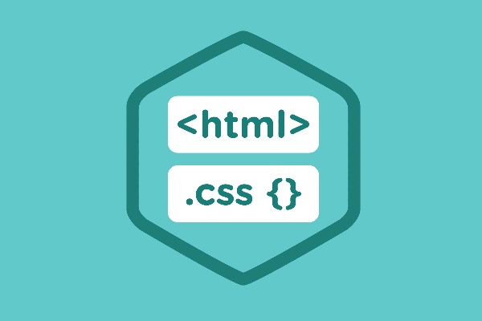

Recently I started learning Html & CSS. HTML is used for content writing and CSS is used for designing those content. Let’s take the human body as an example to understand it better. Now here skeleton is Html and CSS part is how muscle cover our skeleton. Every person skeleton has 106 bones, let that person be from INDIA, CHINA, JAPAN, LONDON, U.S or any other part of the world. But their body texture, color, shape, height, etc differ because of the reason that their muscle covers their bodies differently. This is how Html & CSS work. They complete each other.

Now let’s talk more about Html. when we moved ahead in our studies, there were 3 ways to add things to our Html page. Element, Tag and Attributes. Elements being the building blocks of our website. Any Element defined between less than and greater than sign is a tag. Attributes provide information about tag. Attributes aren’t visible on the web page.

Eg- `<a href="https://altcampus.io/">AltCampus</a>`

Here ‘a’ is an element, href is an attribute and `<a>` is a tag.

`<tagname>` start of a tag
`</tagname>` end of tag

Now let’s talk about how we are going to write our html file. Everything in html file will be under `<html>html code</html>tag`. There is only one thing outside html tag which tells our browser the version of html we are using. which is like `<!DOCTYPE html>`.

Our body is divided into two-part. head part which is defined as `<head>……….</head>` and body part defined as`<body>……………………<body>`.

The head part has different tags inside it. For example `<meta>` tags,`<title>` tags,address of of CSS file and etc.
The body again is divided into different parts. Main part is header, main and footer. These are also tags but we will discuss them in the next section.

Tags are divided into two types in accordance with their closing. Self-closing and other we have to manually close it.
self closing tags are ` ,
,`

This is it for html part. Let’s start our CSS part.
There are three ways in which we can apply CSS to our html file. inline, internal and external. we prefer external as its the best practise in web development.

whenever we want to apply design our to html file we do it through a selector. There is three type of selector. they are type, class and id selector. Each selector stores a property and its value.

So till now we only did text editing and decoration, it leads to another conclusion that html and CSS are not a programming language rather a markup and designing language.